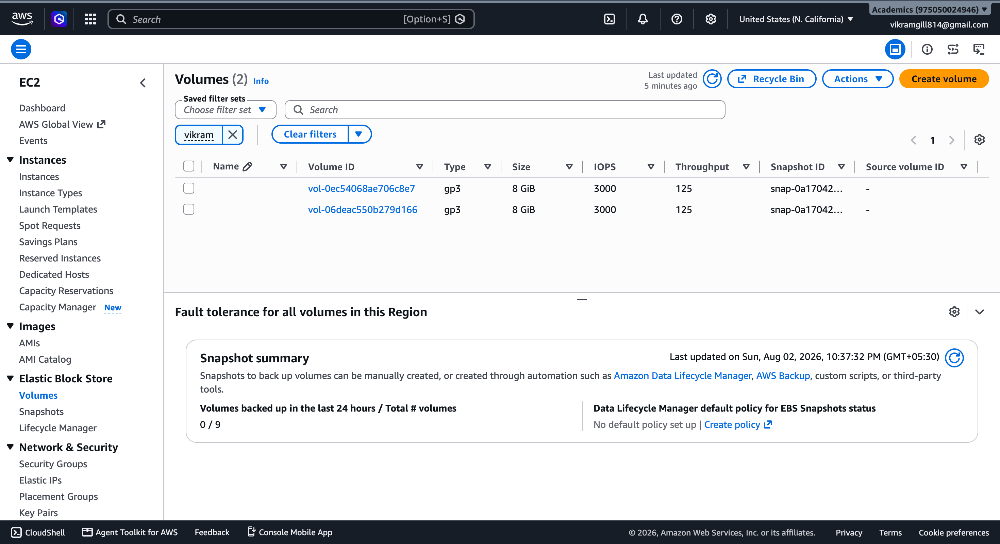
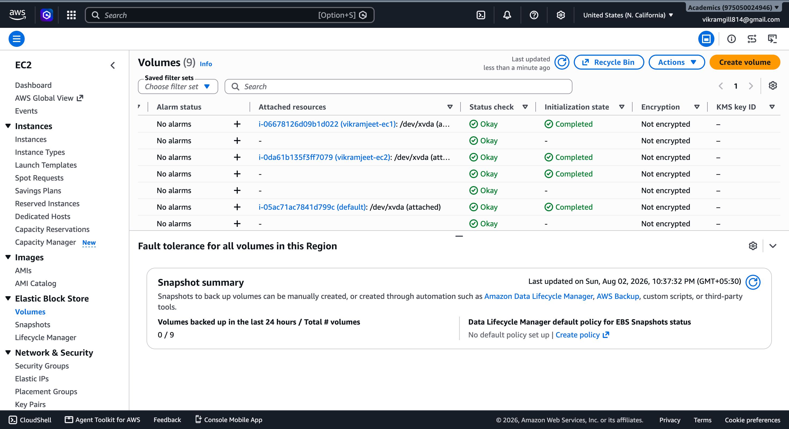
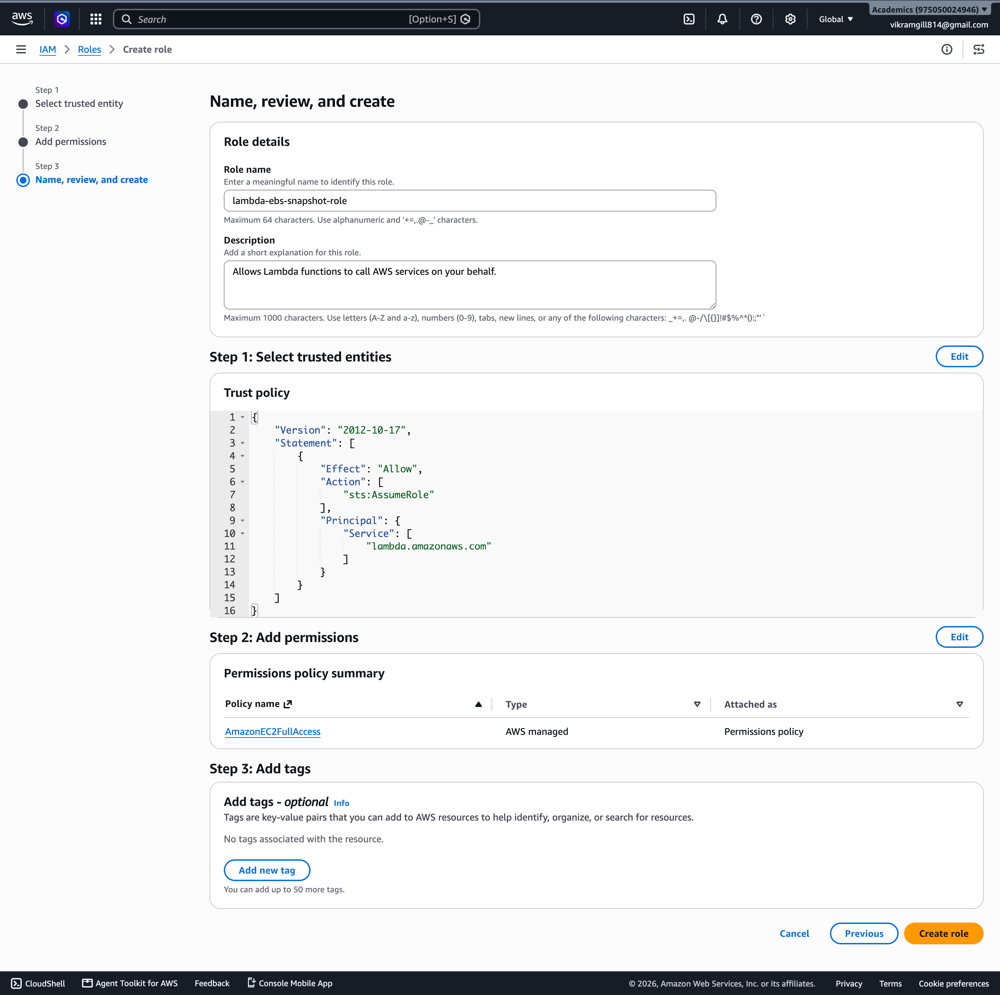
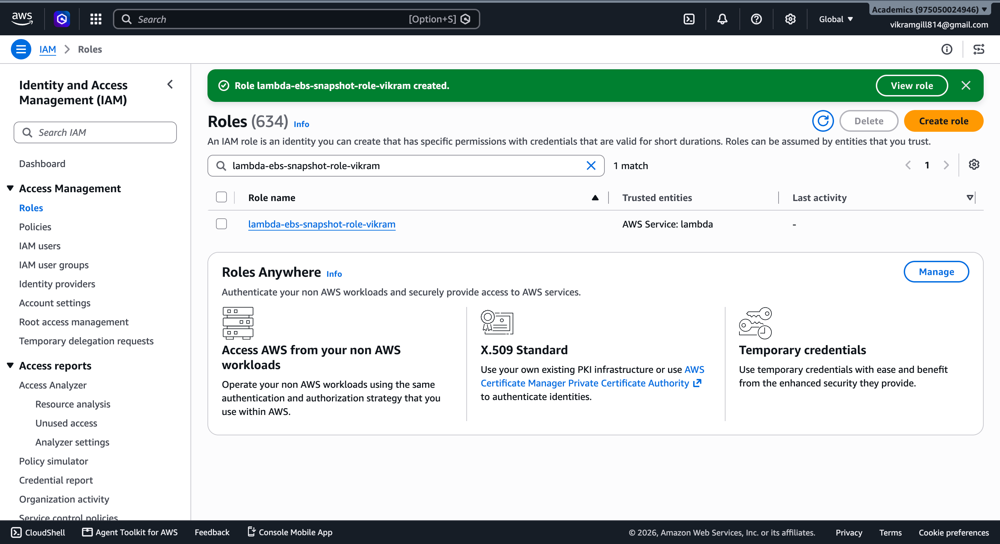
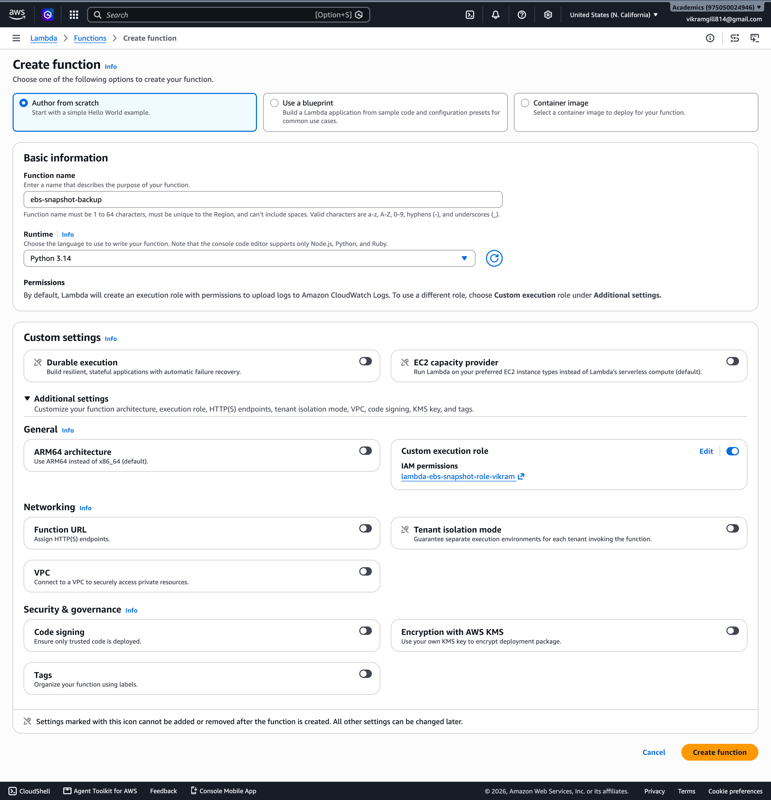

# Assignment 4: Automatic EBS Snapshot and Cleanup Using AWS Lambda and Boto3

## Objective
Automate the creation of EBS volume snapshots for backup purposes, and automatically clean up snapshots older than a defined retention period to control storage costs.

## Architecture
- One EBS volume (`vol-06deac550b279d166`), the root volume attached to EC2 instance `vikramjeet-ec1`
- One Lambda function (`ebs-snapshot-backup`) that:
  - Creates a new snapshot of the volume, tagged with `CreatedBy: automated-backup-lambda` and a timestamped description
  - Describes all snapshots owned by this account (`OwnerIds=['self']`) for that volume
  - Deletes any snapshot older than 30 days (`RETENTION_DAYS`)
  - Logs every created/deleted snapshot ID to CloudWatch Logs
- One IAM role (`lambda-ebs-snapshot-role-vikram`) with the `AmazonEC2FullAccess` managed policy attached, used as the Lambda execution role

## Files Included
- `lambda_function.py` — main AWS Lambda function code using Boto3
- `README.md` — assignment summary, architecture, test results, and screenshot references
- `screenshots/` — console images documenting the EBS volume, IAM role, Lambda function creation, and test invocation

## How to Use
1. Review `lambda_function.py` and update `VOLUME_ID` to match the target EBS volume in your account.
2. Create a Lambda execution role that allows Lambda to call EC2 APIs. This implementation used `AmazonEC2FullAccess` for simplicity.
3. Deploy the Lambda function with Python 3.14 and the role `lambda-ebs-snapshot-role-vikram`.
4. Test using a manual event payload (content is ignored by the function).
5. For production, schedule the function with Amazon EventBridge on a daily or hourly backup cadence.

## Steps Followed

### 1. Identify the EBS Volume
- Located the volume via EC2 → Elastic Block Store → Volumes, filtered to the `us-west-1` region where `vikramjeet-ec1` and `vikramjeet-ec2` (from Assignment 1) are running
- Volume ID used: `vol-06deac550b279d166`
- Screenshots:
  
  

### 2. IAM Role for Lambda
- Created role `lambda-ebs-snapshot-role-vikram`
  - Trusted entity: AWS service → Lambda
  - Permissions policy: `AmazonEC2FullAccess` (snapshot create/describe/delete all fall under the EC2 API)
- Screenshots:
  
  

### 3. Lambda Function
- Created function `ebs-snapshot-backup`
  - Runtime: Python 3.14
  - Execution role: existing role → `lambda-ebs-snapshot-role-vikram`
- Implemented two helper functions:
  - `create_snapshot(volume_id)` — creates a tagged, timestamped snapshot
  - `cleanup_old_snapshots(volume_id, retention_days)` — filters snapshots by `volume-id` and `OwnerIds=['self']`, then deletes any snapshot whose `StartTime` is older than the retention cutoff
- Deployed the function
- Screenshot:
  

### 4. Manual Invocation / Testing
- Created a test event (`manualTest`) with default JSON payload (event data is not used by this function)
- Invoked the function via the **Test** tab in the Lambda console
- Result:
  ```json
  {
    "created_snapshot": "snap-09e9860fabe6683d5",
    "deleted_snapshots": [],
    "retention_days": 30
  }
  ```
- CloudWatch logs confirmed:
  ```
  Created snapshot: snap-09e9860fabe6683d5 for volume vol-06deac550b279d166
  ```
- `deleted_snapshots` was empty as expected, since no existing snapshot was older than 30 days at test time
- Screenshot showing the Lambda function console and test invocation result:
  

### 5. Verification
- Confirmed in the EC2 console (Elastic Block Store → Snapshots) that `snap-09e9860fabe6683d5` was created and transitioned from "pending" to "completed"

## Code
See `lambda_function.py` for the full Boto3 script.

## Key Learnings / Notes
- EBS snapshot creation is **asynchronous** — the `create_snapshot` API call returns a snapshot ID immediately (execution took ~720ms), while the actual data copy to the backing storage completes in the background over the following minutes.
- EBS snapshots are **incremental**: the first snapshot of a volume copies all data, but every snapshot after that only stores the blocks that changed since the previous snapshot — this keeps backup storage costs low even with frequent snapshots.
- `OwnerIds=['self']` in `describe_snapshots()` is important in a shared/training AWS account — without it, the call could also surface public snapshots (e.g. AWS's own AMI-backing snapshots) that don't belong to this account.
- In production, this Lambda would typically be triggered on a schedule via **Amazon EventBridge** (e.g. `cron(0 2 * * ? *)` for a daily 2 AM backup) rather than invoked manually.

## Result
The Lambda function correctly creates a tagged, timestamped snapshot of the target EBS volume on each run and cleans up any snapshots past the 30-day retention window, providing a simple automated backup rotation.