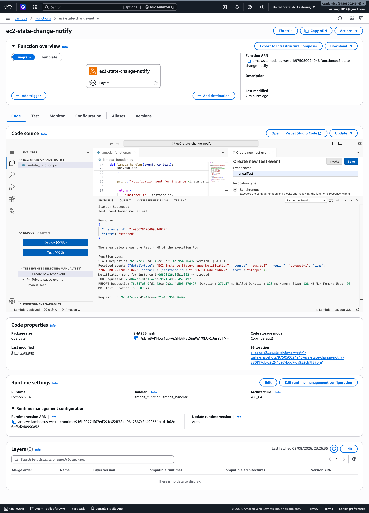
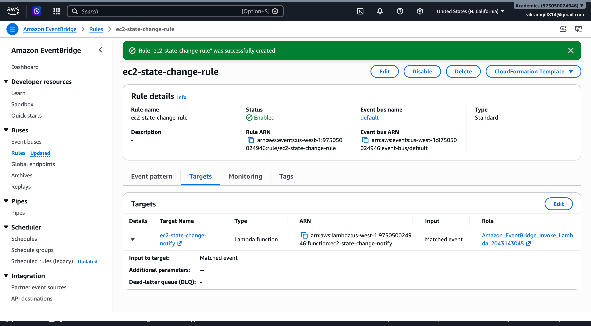
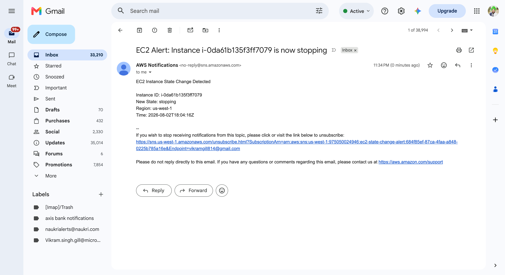

# Assignment 14: Monitor EC2 Instance State Changes Using AWS Lambda, Boto3, and SNS

## Overview
This assignment creates an event-driven AWS workflow that detects EC2 instance state changes and sends an email alert through SNS.

The workflow is:
- EC2 emits a state-change event
- EventBridge matches the event pattern
- Lambda receives the matched event payload
- Lambda formats the event data and publishes it to an SNS topic
- SNS sends an email notification to a confirmed subscriber

## Architecture
- Lambda function: `ec2-state-change-notify`
  - Runtime: Python 3.14
  - Reads the EventBridge event payload from `event['detail']`
  - Extracts `instance-id`, `state`, `region`, and `time`
  - Publishes a clear alert message to SNS
- EventBridge rule: `ec2-state-change-rule`
  - Event bus: `default`
  - Pattern: `source=aws.ec2` and `detail-type=EC2 Instance State-change Notification`
  - Target: `ec2-state-change-notify`
- SNS topic: `ec2-state-change-alert`
  - Email subscription confirmed for alert delivery
- IAM role: `lambda-ec2-state-notify-role`
  - Permissions: `AmazonSNSFullAccess`
  - No direct EC2 API permissions required because the event contains all necessary data

## Screenshots




The screenshot below shows the actual SNS email alert received in Gmail.



## Setup and Implementation

### 1. Create the SNS topic
- Create `ec2-state-change-alert`
- Add an email subscription and confirm it
- Confirmed subscription status is required for delivery
- Topic ARN used in Lambda for publishing

### 2. Create the Lambda execution role
- Role name: `lambda-ec2-state-notify-role`
- Trusted entity: Lambda service
- Attached policy: `AmazonSNSFullAccess`
- The Lambda function only publishes to SNS; it does not call EC2 APIs directly

### 3. Build the Lambda function
- Function name: `ec2-state-change-notify`
- Runtime: Python 3.14
- Handler: `lambda_function.lambda_handler`
- Attach the `lambda-ec2-state-notify-role`

### 4. Use EventBridge event payloads directly
This assignment uses the event payload from EventBridge rather than a manual test event.

The Lambda code extracts:
- `event['detail']['instance-id']`
- `event['detail']['state']`
- `event['region']`
- `event['time']`

These values are included by EventBridge for EC2 state-change notifications.

### 5. Create the EventBridge rule
- Rule name: `ec2-state-change-rule`
- Event bus: `default`
- Event pattern:
  ```json
  {
    "source": ["aws.ec2"],
    "detail-type": ["EC2 Instance State-change Notification"]
  }
  ```
- Target: Lambda function `ec2-state-change-notify`

## Validation
1. Stop or start an EC2 instance in the same AWS region.
2. EventBridge matches the state change event.
3. Lambda receives the matched payload and publishes to SNS.
4. SNS sends an email alert to the confirmed subscriber.

### Example output received by email
```
EC2 Instance State Change Detected

Instance ID: i-0da61b135f3ff7079
New State: stopping
Region: us-west-1
Time: 2026-08-02T18:04:16Z
```

## Notes
- This assignment demonstrates an event-driven notification pipeline rather than a manual Lambda invocation workflow.
- Because EC2 state changes may emit several transitions, a single stop/start action can produce multiple alerts (`stopping` then `stopped`, or `pending` then `running`).
- The rule is useful for compliance, incident awareness, and alerting on unexpected EC2 lifecycle events.

## Code
See `lambda_function.py` for the full Lambda implementation.
